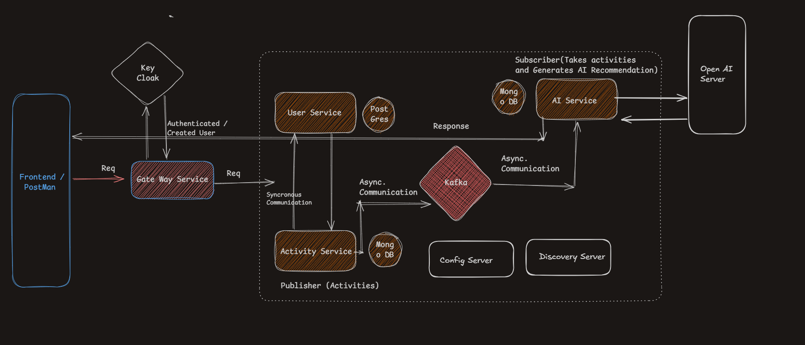

# 🏋️ Fitness Microservice Application - AI-Powered Recommendations

**An intelligent microservice-based fitness tracking platform that validates users, logs activities, and generates AI-powered personalized health recommendations using OpenAI.**

---

## 📖 Project Overview

### What Does This System Do?

This is a **complete end-to-end fitness tracking system** that:

1. **Accepts user fitness activities** (running, cycling, gym, etc. with duration, heart rate, calories)
2. **Validates user legitimacy** immediately using synchronous REST calls
3. **Stores activities** in MongoDB
4. **Triggers AI recommendation generation** asynchronously via Kafka
5. **Generates personalized insights** using OpenAI GPT-4:
   - Optimal activity duration for health goals
   - Heart rate analysis and cardiovascular insights
   - How this activity improves overall health
   - What the user should improve based on fitness goals
   - Safety cautions and medical recommendations
6. **Delivers recommendations** to the frontend on demand

### Key Achievement

This demonstrates a **production-ready microservice architecture** combining:
- Real-time synchronous validation (REST)
- Event-driven async processing (Kafka)
- AI/ML integration (OpenAI)
- Enterprise patterns (API Gateway, Service Discovery, Config Management)

---

## 🏗️ System Architecture Diagram

**ARCHITECTURE DIAGRAM** (view in GitHub or click link below):



**Alternative Link:** [ArchitectureHighLevelPlan.png](ArchitectureHighLevelPlan.png)


---

## Complete Workflow Explanation

### Phase 1: Request Entry & Authentication

```
1. Client (Frontend/Postman) → API Gateway Service
   ├── All requests hit the gateway first
   └── Gateway routes to appropriate service via Eureka discovery

2. API Gateway → Keycloak (Authentication)
   ├── User credentials validated
   ├── JWT token issued (or new user created)
   └── Only authenticated requests proceed
```

### Phase 2: Service Configuration & Discovery

```
3. All Microservices ← Eureka Server
   ├── Service registration (on startup)
   ├── Service discovery (for inter-service calls)
   └── Health monitoring

4. All Microservices ← Config Server
   ├── Load environment-specific configuration
   ├── Database connection strings
   ├── API keys, ports, and settings
   └── All services are centrally configured
```

### Phase 3: Activity Service Processing (Synchronous)

```
5. User submits activity → Activity Service
   ├── Activity details received (type, duration, heart rate, calories, etc.)
   └── MVC Flow:
       ├── Controller: Accept HTTP request
       ├── Service: Execute business logic
       └── Repository: Persist to MongoDB

6. Activity Service → User Service (Synchronous REST call)
   ├── Validate: Is this user legitimate?
   ├── User Service checks MongoDB for user existence
   └── Response: User valid? → Proceed : Reject
```

### Phase 4: Event-Driven AI Pipeline (Asynchronous)

```
7. Activity Service → Kafka (Publisher)
   ├── Valid activity published as an event
   ├── Event contains: userId, activityType, duration, heartRate, caloriesBurned, etc.
   └── Activity Service returns success to Frontend

8. AI Service ← Kafka (Subscriber/Consumer)
   ├── Listens for activity events on Kafka topic
   ├── When event received:
   │   ├── Extract activity details
   │   ├── Perform prompt engineering & optimization
   │   └── Format optimal prompt for OpenAI
   │
   └── Call OpenAI API with engineered prompt
       ├── Send: Activity details + User fitness goals
       └── Receive: AI-generated recommendations

9. AI Service generates personalized recommendations including:
   ├── How long the activity should ideally be
   ├── Heart rate analysis and insights
   ├── Health improvements expected from this activity
   ├── What the user should improve based on their fitness goals
   ├── Cautions and safety notes
   └── Goal-specific tips and suggestions

10. AI Service → MongoDB
    ├── Store recommendations
    └── Link to user & activity
```

### Phase 5: Frontend Retrieval

```
11. Frontend → API Gateway → AI Service
    ├── Request recommendations for a user/activity
    └── AI Service returns stored AI-generated insights
        ├── Via MVC pattern (Controller → Service → Repository)
        └── Response sent to frontend for display
```

---

## 🔗 Inter-Microservice Communication

### Overview: How Services Talk to Each Other

The system uses **THREE communication patterns** depending on the use case:

```
┌─────────────────────────────────────────────────────────────────────┐
│                    COMMUNICATION PATTERNS                           │
├─────────────────────────────────────────────────────────────────────┤
│                                                                     │
│  1. REST (Synchronous, Blocking)                                  │
│     └─> Activity Service ──REST──> User Service                   │
│         (Immediate validation needed)                             │
│                                                                     │
│  2. Kafka (Asynchronous, Non-blocking)                            │
│     └─> Activity Service ──Kafka──> AI Service                    │
│         (Can process later, decoupled)                            │
│                                                                     │
│  3. Eureka Discovery                                              │
│     └─> All Services ──Register──> Eureka Server                  │
│         (Dynamic service lookup)                                  │
│                                                                     │
│  4. Config Server                                                 │
│     └─> All Services ──Fetch Config──> Config Server              │
│         (Centralized configuration)                               │
│                                                                     │
└─────────────────────────────────────────────────────────────────────┘
```

### 1️⃣ Synchronous Communication (REST) - Activity → User Service

**When:** Activity Service needs immediate user validation

**Flow:**
```
Activity Service (Activity Controller receives POST /activities)
         │
         ├─ Extracts: userId, activityType, duration, heartRate, calories
         │
         ├─ Calls: GET /api/users/{userId}/validate
         │          (Synchronous REST call via RestClient)
         │
    ▼    ▼    ▼
User Service (User Controller responds)
    ├─ Queries MongoDB: Does user exist?
    ├─ Returns: { valid: true, user: {...} }
    └─ Returns: { valid: false, error: "User not found" }
         │
    ▼    ▼    ▼
Activity Service (waits for response)
    ├─ IF valid → Continue processing
    ├─ IF invalid → Return 404 to frontend
         │
    ▼    ▼    ▼
Proceed to Kafka publishing (if valid)
```

**Code Example (Pseudo):**
```java
// Activity Service
@PostMapping("/activities")
public ResponseEntity createActivity(@RequestBody ActivityDTO activity) {
    // 1. Call User Service synchronously
    UserValidationResponse validation = 
        restClient.get("http://user-service/api/users/" + activity.userId + "/validate")
                  .retrieve()
                  .body(UserValidationResponse.class);
    
    // 2. If invalid, reject immediately
    if (!validation.isValid()) {
        return ResponseEntity.notFound().build();
    }
    
    // 3. If valid, save and publish
    activityRepository.save(activity);
    kafkaTemplate.send("activity-events", activity);
    return ResponseEntity.ok(activity);
}
```

**Why Synchronous?**
- ✅ User validation must be immediate
- ✅ Cannot proceed without knowing if user is legitimate
- ✅ Client expects instant response
- ✅ Must reject invalid activities before publishing

---

### 2️⃣ Asynchronous Communication (Kafka) - Activity → AI Service

**When:** Activity needs to be processed by AI (non-blocking)

**Flow:**
```
Activity Service (after user validation)
    │
    ├─ Publishes to Kafka Topic: "activity-events"
    │
    └─ Message Content:
       {
         "userId": "user-123",
         "activityId": "activity-456",
         "activityType": "running",
         "duration": 45,
         "heartRate": 155,
         "caloriesBurned": 450,
         "timestamp": "2026-04-03T10:30:00Z",
         "fitnessGoal": "lose-weight"
       }
    │
    └─ Returns SUCCESS to Frontend immediately
       (Activity stored, processing continues in background)

                    ▼    ▼    ▼

Kafka Broker (Message Queue)
    └─ Stores message in topic partition

                    ▼    ▼    ▼

AI Service (Kafka Listener)
    ├─ Subscribes to topic: "activity-events"
    │
    ├─ Consumes message:
    │  {
    │    "userId": "user-123",
    │    "activityType": "running",
    │    ...
    │  }
    │
    ├─ Performs Prompt Engineering:
    │  "User ran for 45 mins, heart rate 155 bpm, burned 450 cal.
    │   Goal: lose weight. Generate personalized recommendations."
    │
    ├─ Calls OpenAI API:
    │  POST https://api.openai.com/v1/chat/completions
    │  with engineered prompt
    │
    ├─ Receives AI Response:
    │  "Based on your 45-min run... you should focus on
    │   consistency... your heart rate indicates good cardio...
    │   to lose weight, increase intensity... Caution: monitor
    │   hydration at this intensity"
    │
    └─ Stores in MongoDB Recommendations collection:
       {
         "_id": ObjectId,
         "userId": "user-123",
         "activityId": "activity-456",
         "recommendation": "Based on your 45-min run...",
         "createdAt": "2026-04-03T10:35:00Z"
       }

                    ▼    ▼    ▼

Frontend (later, on demand)
    └─ Requests: GET /api/recommendations/user/user-123
       Receives: AI-generated personalized insights
```

**Message Structure (Kafka Event):**
```json
{
  "userId": "user-123",
  "activityId": "activity-456",
  "activityType": "running",
  "duration": 45,
  "heartRate": 155,
  "caloriesBurned": 450,
  "timestamp": "2026-04-03T10:30:00Z",
  "fitnessGoal": "lose-weight",
  "userAge": 28,
  "userWeight": 75
}
```

**Code Example (Pseudo):**
```java
// Activity Service (Publisher)
private KafkaTemplate<String, Activity> kafkaTemplate;

public void publishActivityEvent(Activity activity) {
    kafkaTemplate.send("activity-events", activity.getUserId(), activity);
}

// AI Service (Subscriber/Consumer)
@KafkaListener(topics = "activity-events", groupId = "ai-service-group")
public void consumeActivityEvent(Activity activity) {
    // 1. Extract details
    String prompt = enginePrompt(activity);
    
    // 2. Call OpenAI
    String recommendation = openAiClient.generateRecommendation(prompt);
    
    // 3. Store result
    Recommendation rec = new Recommendation(
        activity.getUserId(),
        activity.getActivityId(),
        recommendation
    );
    recommendationRepository.save(rec);
}
```

**Why Asynchronous?**
- ✅ AI processing can take several seconds
- ✅ Don't want to block the user while waiting for OpenAI
- ✅ Activity already validated and stored
- ✅ Frontend gets immediate response
- ✅ Recommendations available when user requests them later

---

### 3️⃣ Service Discovery (Eureka)

**When:** One service needs to call another but doesn't know its IP/port

**Flow:**
```
Activity Service (startup)
    ├─ Registers with Eureka:
    │  "I am Activity Service at 192.168.1.100:8082"
    │
    └─ Eureka stores in registry

User Service (startup)
    ├─ Registers with Eureka:
    │  "I am User Service at 192.168.1.101:8081"
    │
    └─ Eureka stores in registry

Activity Service (needs to call User Service)
    ├─ Asks Eureka: "Where is User Service?"
    │  GET http://eureka-server:8761/eureka/apps/user-service
    │
    ├─ Eureka responds: 
    │  "At 192.168.1.101:8081"
    │
    └─ Activity Service calls:
       GET http://192.168.1.101:8081/api/users/123/validate
```

**Benefits:**
- ✅ No hardcoded URLs
- ✅ Services can move/scale without code changes
- ✅ Automatic failover if one instance goes down

---

### 4️⃣ Centralized Configuration (Config Server)

**When:** All services need to read settings from one place

**Flow:**
```
Activity Service (startup)
    ├─ Connects to Config Server
    │
    ├─ Requests: "Get config for app=activity-service, profile=prod"
    │
    ├─ Config Server responds with:
    │  {
    │    "kafka.topic": "activity-events",
    │    "user-service.url": "http://user-service:8081",
    │    "database.url": "mongodb://localhost:27017",
    │    "openai.api-key": "sk-xxxx"
    │  }
    │
    └─ Activity Service loads these properties
```

---

## Communication Pattern Summary Table

| Pattern | Used By | Direction | Blocking? | Why |
|---------|---------|-----------|-----------|-----|
| **REST (Sync)** | Activity → User | Request/Response | YES | Immediate validation needed |
| **Kafka (Async)** | Activity → AI | Event Publishing | NO | Long processing, non-blocking |
| **Eureka (Discovery)** | Any → Any | Registry Query | NO | Dynamic service location |
| **Config Server** | All Services | Config Pull | NO | Centralized settings |

---

## Microservices Breakdown

### 1. **API Gateway Service**
- **Role:** Entry point, routing, security
- **Responsibilities:**
  - Route incoming requests to User/Activity/AI services
  - Enforce Keycloak authentication
  - Use Eureka for service discovery
- **Framework:** Spring Cloud Gateway
- **Pattern:** MVC

### 2. **User Service**
- **Role:** User management
- **Responsibilities:**
  - Register new users
  - Maintain user profiles (fitness goals, health data)
  - Validate user legitimacy (called by Activity Service)
- **Database:** MongoDB
- **Pattern:** MVC
  - **Controller:** REST endpoints for user operations
  - **Service:** User validation & profile logic
  - **Repository:** MongoDB data access

### 3. **Activity Service** (`demo/` folder)
- **Role:** Activity tracking
- **Responsibilities:**
  - Accept user activity submissions
  - Validate user legitimacy (synchronous call to User Service)
  - Store activities in MongoDB
  - Publish activity events to Kafka
- **Communication:**
  - **Sync:** REST call to User Service
  - **Async:** Kafka publisher
- **Pattern:** MVC
  - **Controller:** Receive activity data
  - **Service:** Validation + Kafka publishing logic
  - **Repository:** MongoDB storage

### 4. **AI Service** (`AI-Service/` folder)
- **Role:** AI recommendation generation
- **Responsibilities:**
  - Kafka consumer (subscribe to activity events)
  - Prompt engineering & optimization
  - OpenAI API integration
  - Store recommendations in MongoDB
  - Serve recommendations to frontend
- **Key Features:**
  - Activity-specific recommendation generation
  - User goal-based insights
  - Duration, heart rate, and health analysis
- **Pattern:** MVC
  - **Controller:** REST endpoints for retrieving recommendations
  - **Service:** AI logic + OpenAI integration + Kafka consumption
  - **Repository:** MongoDB storage of recommendations

### 5. **Eureka Server** (Discovery Server)
- **Role:** Service registry
- **Responsibilities:**
  - All services register on startup
  - Enable service-to-service discovery
  - Health checks

### 6. **Config Server**
- **Role:** Centralized configuration
- **Responsibilities:**
  - Store config for all environments
  - Provide config to services on request
  - Enable dynamic configuration without redeployment

---

## Technology Stack

| Component | Technology | Version |
|-----------|-----------|---------|
| Language | Java | 21 |
| Framework | Spring Boot | 4.0.x |
| Cloud | Spring Cloud | 2025.1.1 |
| Gateway | Spring Cloud Gateway | Latest |
| Service Discovery | Netflix Eureka | Latest |
| Config Management | Spring Cloud Config | Latest |
| Message Broker | Apache Kafka | Latest |
| Database | MongoDB | Latest |
| Authentication | Keycloak | Latest |
| AI Integration | Spring AI + OpenAI | 2.0.0-M3 |
| Build Tool | Maven | 3.x |

---

## Project Structure

```
FIitnessMicroservice/
├── APIGateWay/
│   ├── pom.xml
│   ├── src/
│   │   ├── main/java/com/fitness/...
│   │   └── test/
│   └── (Spring Cloud Gateway configuration)
│
├── userservice/
│   ├── pom.xml
│   ├── src/main/java/
│   │   ├── controller/     (REST endpoints)
│   │   ├── service/        (Business logic)
│   │   ├── repository/     (Data access)
│   │   └── model/          (Entities)
│   └── resources/
│
├── demo/                   (Activity Service)
│   ├── pom.xml
│   ├── src/main/java/
│   │   ├── controller/     (Activity endpoints)
│   │   ├── service/        (Activity + Kafka logic)
│   │   ├── repository/     (MongoDB access)
│   │   ├── model/          (Activity entity)
│   │   └── config/         (Kafka configuration)
│   └── resources/
│
├── AI-Service/
│   ├── pom.xml
│   ├── src/main/java/
│   │   ├── controller/     (Recommendation endpoints)
│   │   ├── service/        (AI + Kafka consumer + OpenAI)
│   │   ├── repository/     (MongoDB access)
│   │   ├── model/          (Recommendation entity)
│   │   └── config/         (Kafka + OpenAI config)
│   └── resources/
│
├── eureka/                 (Discovery Server)
│   ├── pom.xml
│   └── src/
│
├── configServer/           (Configuration Server)
│   ├── pom.xml
│   └── src/
│
└── ArchitectureHighLevelPlan.png
```

---

## MVC Pattern Implementation

Each service follows the **Model-View-Controller** pattern:

### Example: Activity Service

```
Controller Layer
  └─> ActivityController.java
      ├── @PostMapping("/activities")
      ├── @GetMapping("/activities/{id}")
      └── Handles HTTP requests

Service Layer
  └─> ActivityService.java
      ├── validateUser(userId)        [Sync REST call]
      ├── saveActivity(activity)      [MongoDB save]
      ├── publishToKafka(activity)   [Event publishing]
      └── Business logic & orchestration

Repository Layer
  └─> ActivityRepository.java
      ├── save(activity)
      ├── findById(id)
      └── MongoDB data access

Model Layer
  └─> Activity.java
      ├── @Id mongoId
      ├── userId
      ├── activityType
      ├── duration
      ├── heartRate
      └── caloriesBurned
```

---

## Communication Patterns

### Synchronous Communication (REST)
**Used for:** Activity Service → User Service validation
- Activity Service makes a direct REST call to User Service
- Waits for response (blocks until validation complete)
- Immediate feedback required

### Asynchronous Communication (Kafka)
**Used for:** Activity Service → AI Service
- Activity Service publishes event to Kafka
- Returns immediately (non-blocking)
- AI Service consumes when available
- Decouples services for scalability

### Service Discovery (Eureka)
**Used for:** Finding service instances
- All services register with Eureka on startup
- When calling another service, gateway queries Eureka
- Enables dynamic scaling

### Configuration Management (Config Server)
**Used for:** Centralized settings
- All services fetch config from Config Server
- Environment-specific (dev, prod, test)
- Changes can be applied without redeployment

---

## Key Architectural Benefits

✅ **Scalability**: Each service can scale independently
✅ **Resilience**: Asynchronous processing via Kafka prevents bottlenecks
✅ **Security**: Keycloak centralized authentication
✅ **Maintainability**: Clear separation of concerns (MVC)
✅ **Flexibility**: Microservices loosely coupled
✅ **Configuration**: Centralized config management
✅ **AI-Ready**: OpenAI integration for intelligent recommendations
✅ **Event-Driven**: Kafka enables reactive, responsive systems

---

## Getting Started

### Prerequisites
- Java 21+
- Maven 3.6+
- Docker (for Kafka, MongoDB, Keycloak)
- Git

### Quick Start

1. **Clone Repository**
   ```bash
   git clone <repo-url>
   cd FIitnessMicroservice
   ```

2. **Start Infrastructure** (Docker)
   ```bash
   docker-compose up -d  # Kafka, MongoDB, Keycloak, Eureka
   ```

3. **Build Project**
   ```bash
   mvn clean install
   ```

4. **Start Services** (in order)
   ```bash
   # Terminal 1: Eureka
   cd eureka && mvn spring-boot:run
   
   # Terminal 2: Config Server
   cd ../configServer && mvn spring-boot:run
   
   # Terminal 3: API Gateway
   cd ../APIGateWay && mvn spring-boot:run
   
   # Terminal 4: User Service
   cd ../userservice && mvn spring-boot:run
   
   # Terminal 5: Activity Service
   cd ../demo/demo && mvn spring-boot:run
   
   # Terminal 6: AI Service
   cd ../AI-Service && mvn spring-boot:run
   ```

5. **Verify**
   - Eureka Dashboard: `http://localhost:8761`
   - API Gateway: `http://localhost:8080`

---

## API Endpoints

### User Service
```
POST   /api/users/register              Register new user
GET    /api/users/{userId}              Get user profile
GET    /api/users/{userId}/validate     Validate user exists
```

### Activity Service
```
POST   /activities                      Create new activity
GET    /activities/{activityId}         Get activity details
```

### AI Service (Recommendations)
```
GET    /api/recommendations/user/{userId}           Get all recommendations for user
GET    /api/recommendations/activity/{activityId}   Get recommendation for activity
GET    /api/recommendations/{recommendationId}      Get specific recommendation
```

---

## Design Patterns Used

1. **Microservice Pattern** - Independent, deployable services
2. **API Gateway Pattern** - Single entry point
3. **Service Discovery Pattern** - Eureka for service location
4. **Event-Driven Pattern** - Kafka for async processing
5. **MVC Pattern** - Controller-Service-Repository in each service
6. **Configuration Server Pattern** - Externalized config

---

## What This Demonstrates

✨ Modern Spring Cloud architecture
✨ Microservice design principles
✨ Event-driven asynchronous processing
✨ AI/ML integration (OpenAI)
✨ Centralized security (Keycloak)
✨ Service discovery and configuration management
✨ Production-ready patterns and practices

---

**Created:** April 2026
**Architecture:** Event-driven Microservices with AI Integration

